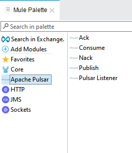
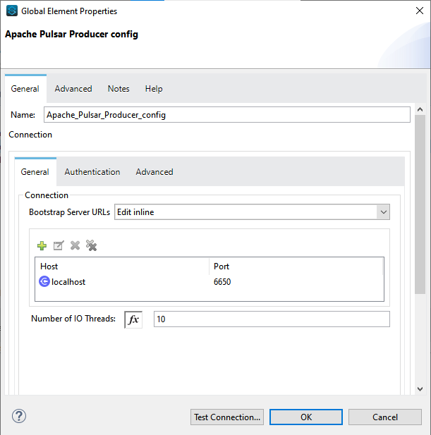
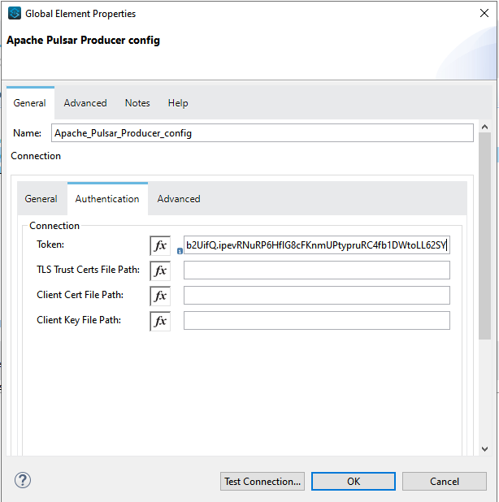
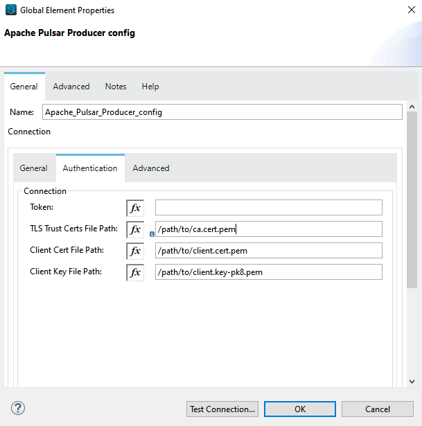
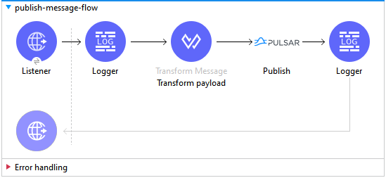
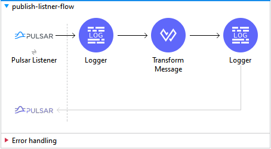
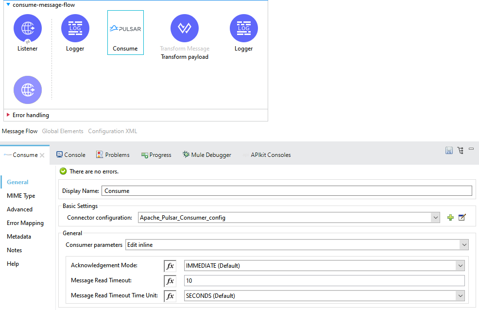
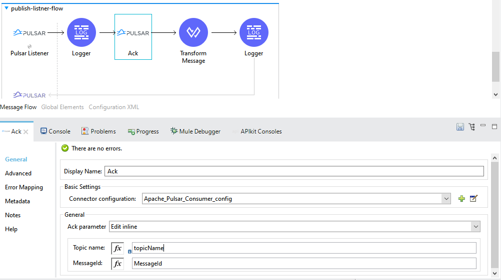
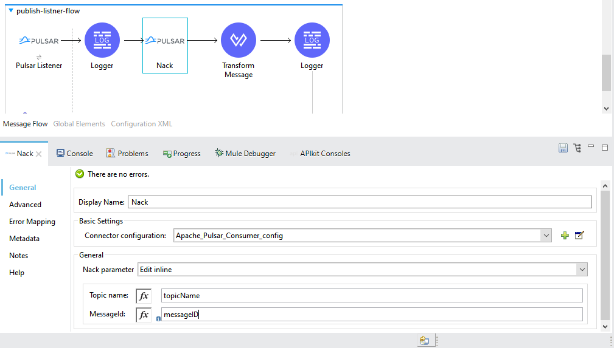

= Apache Pulsar Connector User Manual

== Introduction
A Pulsar connector in Mulesoft allows developers to easily integrate Mulesoft with Apache Pulsar. The connector provides a set of pre-built operations for working with Pulsar, such as sending and receiving messages, creating topics, and managing subscriptions.

Apache Pulsar is a distributed pub-sub messaging system that is designed to handle large-scale data streaming. Mulesoft is a Java-based platform for building and deploying integration and API-led connectivity solutions.

== Prerequisites

This document assumes that you are familiar with Mule 4, https://docs.mulesoft.com/connectors/[Anypoint Connectors,] and https://www.mulesoft.com/lp/dl/studio[Anypoint Studio.] To increase
your familiarity with Studio, consider completing an https://developer.mulesoft.com/tutorials-and-howtos/getting-started/hello-mule/[Anypoint Studio Tutorial.] This page requires some basic knowledge of https://docs.mulesoft.com/mule-runtime/latest/[Mule Concepts,] https://pulsar.apache.org/docs/2.10.x/getting-started-home/[Apache Pulsar], and Data Integration.

== Hardware and Software Requirements

For hardware and software requirements, please visit
the https://docs.mulesoft.com/mule-runtime/4.3/hardware-and-software-requirements[Hardware
and Software Requirements page].
 

=== Mule Compatibility
[%header%autowidth.spread]
|===
|Application/Service |Version
|Mule Runtime |4.3.x and later
|Anypoint Studio | 7.10.x and later
|Apache Pulsar |2.10.x and later
|Java | 8 and later
|===

== Installing the Connector

To use the Pulsar connector in Mulesoft, you will first need to add it to your project. This can be done by searching for the connector in Anypoint Studio using the instructions in https://docs.mulesoft.com/exchange/#installing-a-connector-from-anypoint-exchange[Installing a Connector from Anypoint Exchange.]

{blank}

=== Maven Dependency Information

    <dependency>
        <groupId>com.mulesoft.connectors</groupId>	      
        <artifactId>apache-pulsar-connector</artifactId>
        <version>1.0.0</version>
        <classifier>mule-plugin</classifier>
    </dependency>

{blank}

{blank}

== How to Configure

=== 1. *Apache Pulsar Producer Config*

===   General

* *Bootstrap Server URLs* -
   ** *Host* - localhost
   ** *port* - 6650

* *Number of IO threads* - The number of IO threads in Pulsar Client used in WebSocket proxy. Default *(1)*

===   Authentication (Optional)

----
You must have TLS transport encryption configured on your cluster before you can use TLS authentication.
----

You can use either https://pulsar.apache.org/docs/2.6.0/security-tls-authentication/[TLS Authentication] OR https://pulsar.apache.org/docs/2.6.0/security-jwt/[JSON Web Token Authentication]
 

* *Token* - Tokens are used to identify a Pulsar client and associate with some "principal" (or "role") which will be then granted permissions to do some actions (eg: publish or consume from a topic). https://pulsar.apache.org/docs/next/security-token-admin/#token-authentication-overview[Token Authentication Overview]

The File Path parameter supports the following pattern formats:

----

1 C:\Users\DELL\Documents\SSL\ca.cert.pem
2 C:\Users\DELL\Documents\SSL\client.cert.pem

----

* *TLS TrustCerts File Path* - Path for the trusted TLS certificate file. This cert is used to verify that any certs presented by connecting clients are signed by a certificate authority. If this verification fails, then the certs are untrusted and the connections are dropped.

* *Client Cert File Path* - Path for the TLS certificate file.

* *Client Key File Path* - Path for the TLS private key file.

=== Advanced (Optional)

** *Connection*

* *Client Timeout* - Duration of waiting for a connection to a broker to be established. *Default (30)*

* *Client Timeout Time Unit*  -  Default *(SECONDS)*

* *Operation Timeout* - Maximum amount of time that a client will wait for a request to complete before timing out and canceling the operation. - Default *(30)*

* *Operation Timeout Time Unit* -  Default *(SECONDS)*

** *Pooling profile*

  A pooling profile is a configuration that controls how connections are managed in a pool.
    

* *Max active* - It controls the maximum number of connections that can be created and active in the pool at any given time. Default *(50)*

* *Max idle* - It controls the maximum number of connections that can remain idle in the pool at any given time. Default *(5)*

* *Initialization policy* - It controls how connections are created and initialized in a pool.
*** *INITIALISE_NONE* -  Will not load any components into the pool on startup

*** *INITIALISE_ONE (Default)* -  Will load one initial component into the pool on startup

*** *INITIALISE_ALL* - Will load all components in the pool on startup

* *Exhausted action* - It controls what action the connection pool should take when a request for a connection is made, but none are available. There are three different exhausted action options in MuleSoft:

*** *WHEN_EXHAUSTED_FAIL* - The request for a connection will fail and an exception will be thrown. This is the default behavior.

*** *WHEN_EXHAUSTED_WAIT* - The request will block until a connection becomes available. This can be useful if you want to ensure that all requests for connections are fulfilled, but can lead to poor performance if the pool is frequently exhausted.

*** *WHEN_EXHAUSTED_GROW (Default)* - The pool will create a new connection to satisfy the request. This can be useful if you want to ensure that all requests for connections are fulfilled, but can lead to a large number of connections being created if the pool is frequently exhausted.

* *Max wait* - It controls the maximum amount of time that a request for a connection will block before timing out. Default *(5)*

* *Min eviction (ms)* - It is a configuration that controls the minimum number of idle connections that must be present in the pool before an eviction process starts. Default *(1800000)*

* *Eviction check interval (ms)* - This configuration controls the frequency at which the connection pool runs an eviction process. Default *(-1)*

=== 2. *Apache Pulsar Consumer Config*

===   General

* *Bootstrap Server URLs* -
   ** *Host* - localhost
   ** *port* - 6650
* *Topics* -

.. *Type* - 
... *PERSISTENT (Default)* - A persistent topic in Apache Pulsar is a topic that retains all the messages that are sent to it, even after they have been consumed.

... *NON_PERSISTENT* - A non-persistent topic in Apache Pulsar is a topic that does not retain messages after they have been consumed. This means that the messages are only stored in memory and are discarded once they have been consumed.

.. *Tenant*  -  A tenant can be thought of as a container for different resources that are used to separate and organize those resources in a logical way.Default *(public)*

.. *Namespace* - A namespace is a logical container for topics. Default *(default)*

.. *Name* - A topic is a unique named resource within a namespace to which messages can be sent and from which messages can be consumed. 

* *Subscription Name* - A subscription is a named configuration rule that determines how messages are delivered to consumers.

* *Subscription Type* -  

1. *Shared (Default)* - Multiple consumers can consume messages from a topic simultaneously.

2. *Exclusive* - Only a single consumer is allowed to consume messages from a topic.

3. *Key_Shared* - Depending on the key set multiple consumers can consume messages from a topic simultaneously.

* *ECDSA Public Key path for Decryption* - Pulsar uses dynamically generated symmetric AES key to encrypt messages(data). You can use the application provided ECDSA/RSA key pair to encrypt the AES key(data key), so you do not have to share the secret with everyone.

* *Consumer Crypto Failure Action* - 

1. *FAIL (Default)* - Fails when the listener fails to decrypt the message.

2. *CONSUME* - The Listener will consume the message even if it failed to decrypt.

3. *DISCARD* - The Listener will discard the message from the topic  if it failed to decrypt.

* *Number of IO Threads* - 	The number of threads used for handling connections to brokers. Default *(1)*

* *Number of Listener Threads* - The number of threads used for handling message listeners. Default *(1)*

== Common Operations

=== 1. *Publish*

  To publish messages to Apache Pulsar

. Drag and drop a Publish Pulsar Connector onto your Mulesoft flow.

. Configure the connector with the appropriate connection details for your  Pulsar cluster (e.g. host, port, etc.).

. Use the connector's "publish" operation to send a message to a specific  topic in Pulsar.

.. *Producer Name* (Optional) - By given name, it will create a producer of the topics otherwise default configuration of the producer is used.

.. *Type* - 
... *PERSISTENT (Default)* - A persistent topic in Apache Pulsar is a topic that retains all the messages that are sent to it, even after they have been consumed.

... *NON_PERSISTENT* - A non-persistent topic in Apache Pulsar is a topic that does not retain messages after they have been consumed. This means that the messages are only stored in memory and are discarded once they have been consumed.

.. *Tenant*  -  A tenant can be thought of as a container for different resources that are used to separate and organize those resources in a logical way. Default *(public)*

.. *Namespace* - A namespace is a logical container for topics. Default *(default)*

.. *Name* - A topic is a uniquely named resource within a namespace to which messages can be sent and from which messages can be consumed.

.. *Body* - Message Body

.. *Data Key* (Optional) - The key (string type) of the message. It is a short name of message key or partition key. Messages are optionally tagged with keys, which is useful for features like topic compaction.

.. *ECDSA Public Key path for Encryption* (Optional) - Pulsar uses dynamically generated symmetric AES key to encrypt messages(data). You can use the application provided ECDSA/RSA key pair to encrypt the AES key(data key), so you do not have to share the secret with everyone.

.. *Encryption Key* (Optional) - In Apache Pulsar, an encryption key is used to encrypt and decrypt messages as they are sent and received by the messaging system.

.. *Producer Crypto Failure Action* - 

... *FAIL (Default)* - Fails when the producer fails to encrypt the message.

... *SEND* - The producer will publish the message even if it failed to encrypt the message.

. In the message payload, set the value of the message you want to send.

. In the properties, set the topic name and any other properties you want to send with the message.

. Run your Mulesoft flow and the message should be published to the specified topic in Pulsar.

=== 2. *Pulsar Listner*

  The Pulsar Listner connector allows for the creation of listeners, which can receive messages from Pulsar
   topics and process them within the Mule flow.
  

. Add the Pulsar Listner Connector to your Mulesoft flow.

. In the configuration of the connector, specify the topic and subscription that you want to listen to. You can also specify any other configuration options, such as the number of threads, the Subscripton name, and the Subscription type.

. In the Message Source section of the connector, you can specify how you want to handle the messages that are received. For example, you can specify the message read timeout, and whether you want to use the default acknowledgment or a custom one.

.. *Acknowledgement Mode* -

... *IMMEDIATE (default)* - The immediate acknowledge mode is a feature that allows a consumer to immediately acknowledge the receipt of a message as soon as it is received. 

... *Auto* - Auto acknowledge mode in Apache Pulsar is a feature that allows the consumer to automatically acknowledge the receipt of messages from the Pulsar broker.

... *MANUAL* - Manual acknowledge mode in Apache Pulsar is a feature that allows the consumer to manually acknowledge the receipt of messages from the Pulsar broker.

.. *Message  Read Timeout* - Maximum amount of time to wait for a message to be available for consumption. Default *(10)*

.. *Message  Read Timeout Time Unit* - Default *(SECONDS)*
. You can add a transformer, a processor, or an enricher to the flow to process the messages that are received. For example, you can add a transformer to convert the messages from JSON to XML, or a processor to filter out certain messages based on specific criteria.

. Once you have completed configuring the Apache Pulsar Listener connector, you can test it by sending messages to the topic and subscription that you specified. You should see the messages being received and processed in your flow.

=== 3. *Consume*

  The Consume Pulsar connector allows you to consume messages from a specific topic in Pulsar and process them 
  within the Mule flow.

. Drag the Pulsar Consumer connector into your Mulesoft flow.

. In the Connector Configuration tab, set the connection properties like the Server URLs, the topic, the subscription name, etc.

. You can specify how you want to handle the messages that are received. For example, you can specify the message read timeout, and whether you want to use the default acknowledgment or a custom one.

.. *Acknowledgement Mode* -

... *IMMEDIATE (default)* - The immediate acknowledge mode is a feature that allows a consumer to immediately acknowledge the receipt of a message as soon as it is received. 

... *MANUAL* - Manual acknowledge mode in Apache Pulsar is a feature that allows the consumer to manually acknowledge the receipt of messages from the Pulsar broker.

.. *Message  Read Timeout* - Maximum amount of time to wait for a message to be available for consumption. Default *(10)*

.. *Message  Read Timeout Time Unit* - Default *(SECONDS)*

. You can add a transformer, a processor, or an enricher to the flow to process the messages that are received. For example, you can add a transformer to convert the messages from JSON to XML, or a processor to filter out certain messages based on specific criteria.

. Test your flow by sending a message to the Pulsar topic or subscription you configured, and checking that it is properly consumed and processed by your Mulesoft flow.

=== 4. *Ack*

  ACK in Apache Pulsar refers to an acknowledgment, which is a message sent by a 
  consumer to the Pulsar broker to confirm that it has successfully processed a message. 

. In the Mulesoft Anypoint Studio, open the project where you want to use the ACK Pulsar connector.

. In the Palette, search for and drag the ACK Pulsar connector onto the canvas.

. In the configuration tab, configure the connector by setting the values for the Pulsar broker URL, topic name, and other relevant parameters.

. In the connector's operation, you can set the ACK parameter.

.. *Topic name* (Optional) - By given name it will acknowledge from the specific topic otherwise default configuration of the consumer is used if only one topic is defined in the configuration. If there are multiple topics added in the configuration then you must specify the name of the topic in the field.

.. *MessageId* - MessageId is a unique identifier assigned to a message when it is produced and sent to a topic.

. To test your configuration, you can add a test message and run the flow to see if it is successfully sent to the Pulsar topic.

=== 5. *Nack*

  NACK in Apache Pulsar refers to a Negative Acknowledgement. It is used in the Pulsar protocol to indicate that
  a message was not received by a consumer.

. In your Mulesoft flow, drag and drop the Apache Pulsar connector onto the canvas.

. Configure the connector by providing the necessary connection details such as the Pulsar service URL, topic name, and subscription name.

. In the connector's operation, you can set the NACK parameter.

.. *Topic name* (Optional) - By given name, it will negatively acknowledge the specific topic otherwise default configuration of the consumer is used if only one topic is defined in the configuration. If there are multiple topics added in the configuration then you must specify the name of the topic in the field.

.. *MessageId* - MessageId is a unique identifier assigned to a message when it is produced and sent to a topic.

. To test your configuration, you can add a test message and run the flow to see if it is successfully sent to the Pulsar topic.

